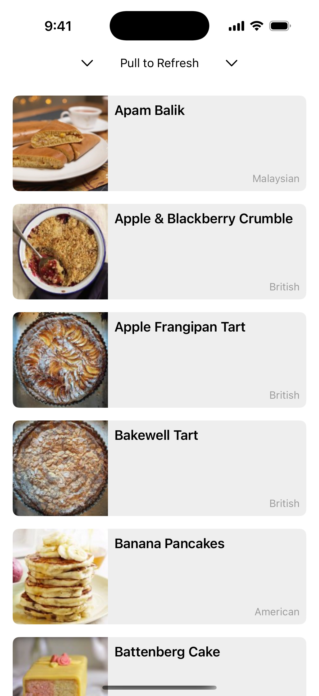
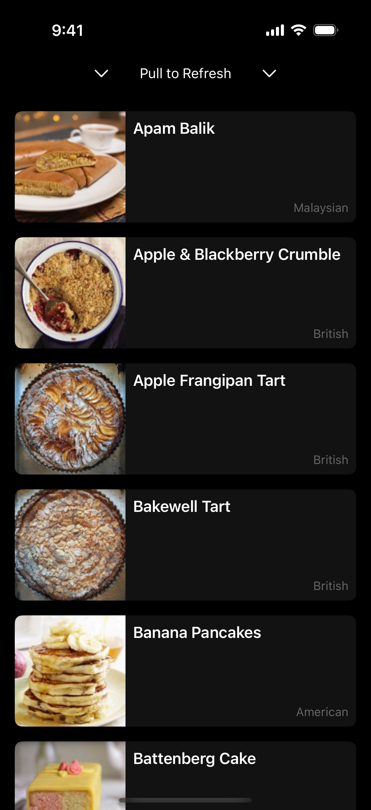

# RecipeApp

## Summary

> _Include screen shots or a video of your app highlighting its features._

**RecipeApp** supports iOS 16+ on iPhones and iPads, is compatible with Light and Dark modes, and supports accessibility type scaling.
Images are loaded only when displayed and are cached after the first request, pulling from local disk for all subsequent requests.
If the local disk is cleared of images, they are simply refetched without causing errors.
Additionally, users can pull-to-refresh to reload the recipe data if the content changes.
Errors are displayed to the user in the form of alerts (for API errors) and image placeholders (for images that can't be loaded).

### Screenshots

  
  

### Demo

The following demo shows the app running on an iOS 18.x simulator next to the simulator's `ImageCache` directory.
Images are lazily fetched and rendered only when displayed as scrolling occurs.
After being fetched the first time, they can be seen getting cached to disk without duplicates.
The files are then manually deleted from disk, and only when scrolling reoccurs do images get refetched and recached.

<https://github.com/user-attachments/assets/acfe8f24-ba8a-4726-9651-51b3e182ce34>

## Focus Areas

> _What specific areas of the project did you prioritize? Why did you choose to focus on these areas?_

I broke the project down into three key areas and pretty much worked through them in order:

1. Recipe API
2. Image Caching
3. App (UI)

These areas each contain a single responsibility and easily fit into their respective modules: `RecipeKit`, `ImageCaching`, and `RecipeApp`.

From there, I tackled the project in order of least to most familiar in order to encounter any surprises upfront ensure I could ask any questions early into the project.

1. The Recipe API comes first because the endpoint is new to me, I don't know what surprises there are in the data, etc. Also, getting API models and mocks in place will help with the other areas.
2. Caching is a very familiar area, but its been a little bit since I've implemented a solution directly rather than use an Apple framework.
3. Finally, I'm extremely familiar with SwiftUI so this would be the least surprising.

## Time Spent

> _Approximately how long did you spend working on this project? How did you allocate your time?_

Altogether I spent somewhere around ~6 hours on the take-home challenge. I started working on the project on Sunday and wrapped it up on Monday, but had some interruptions and distractions throughout.

### Ticketing (~30 minutes)

I started by "ticketing" the acceptance criteria for the project using a simple checklist, ensuring I have everything in one place before I get started.

It included:

1. Any details from ALL project materials provided, reviewed once or twice so nothing gets missed once work is underway.
2. Unknowns and topics I need (or want) to research (eg. Swift 6 Testing framework).
3. Unit tests that I'd want to cover: in this case, the RecipeAPI, HTTPClient, and the ImageCache, the core of the app.
4. SwiftUI preview states to ensure I covered as much as possible.
5. Manual user tests that should be additionally performed prior to submission (eg. device sizes, device types, appearance modes, accessibility text scaling, etc.).

### Development (~4 hours)

I tend to take a very test-driven approach to prototypes, especially with new UIs, so that I'm not debugging SwiftUI alongside networking code or other logic.

1. Created the structure for the project, including Swift Package targets for modularity.
2. Created the RecipeAPI, HTTPClient, and the RecipeKitTests before every touching UI.
3. Created the bulk of the UI so I could run into any gotchas I wasn't expecting.
4. Added the ImageCaching module and its tests.
5. Integrated ImageCaching into the app.

### Review, Test, Polish (~1 hour)

This time was spent reviewing my code, looking at access control throughout the project, refactoring, unit testing, manual testing, and so on.

Given that I kept a checklist of acceptance criteria that I added to throughout the project, the bulk of this phase just meant working down the list, adding new test cases or bugs as they came up, and making sure I could check off every item appropriately.

### This README (~30 minutes)

I kept notes throughout development that I'd want to include back in the README, then compiled the README at the end of the project.

## Trade-offs and Decisions

> _Did you make any significant trade-offs in your approach?_

1. I decided to use iOS 16 to match Fetch even though I'm mostly working in iOS 17+ these days. The only real pain point I hit here was having to use the `ObservableObject` protocol rather than the new `@Observable` macro. `ObservableObject` is more stable in iOS 16+ than in earlier versions, but it still has performance issues due to publishing changes for the entire object any time _any_ `@Published` property is updated. As such, if my `RootView.ViewModel` object grew to contain additional data, I would likely use `PassthroughSubject`/`CurrentValueSubject` and handle the publishing and updating of `View` data directly, such as with `onReceive`.
2. A case could be made that `ImageCache` and/or `RecipeAPI` could use a similar pattern or use different patterns entirely. Ultimately, I tried to build these "core" types such that they would be small and easy to refactor.
3. I decided to work with Swift 6's new `Testing` framework instead of `XCTest` because it seemed like a simple thing to learn on the fly, but it did mean my tests could end up weaker due to lack of familiarity.
4. I'd usually try to start out with some kind of rudimentary design system to extend upon (eg. padding, margin, spacing, colors, fonts, symbols), but decided to use standard intervals and keep the UI simple to avoid spreading the project out too much.
5. I also usually start with an `.xcconfig`-based project configuration off the bat, but again this just felt like too much bloat for a simple project, so I left most of the settings as-is and edited what I needed to directly (eg. deployment target, device types).

## Weakest Part of the Project

> _What do you think is the weakest part of your project?_

I think networking overall is the weakest part of the project, not because it isn't stable or tested well, but because there's a lot of functionality it would be nice to add to it.  

1. `HTTPClient` could have retry and timeout functionality, authentication, and other things necessary for a proper networking client.
2. I went back and forth on using `String` or `URL` directly a few times, same with `UUID`. Both `URL` and `UUID` are `Decodable`, but I ultimately landed on just using `String`s for both in many cases since this application was more directly mirroring an API and it seemed marginally safer, and I wrote tests to compensate.
3. I'd typically try to entirely eliminate networking from non-integration tests and SwiftUI previews, at the very least incorporating a "Local" version of the scheme and directly disabling networking. That said, I tried to cover as much as made sense and added comments as necessary, and it wouldn't be too hard to continue refactoring down that path.
4. `RecipeAPI` would be easy to refactor, but as-is it wouldn't scale well; a little larger and I'd use enum-based endpoints, larger than that and I'd likely start using defined `struct`s that encapsulate the endpoint and parameters and headers, etc.
5. In a real-world scenario, the app could benefit from having recipes cached rather than starting with an empty state and popping the images in.
6. The "no recipes available" empty state is boring.

In addition to networking, there are a variety of smaller items I'd consider weak if I were submitting this to be integrated into a production codebase.

1. `RootView` could likely be broken up a bit more, maybe split into a `DynamicRecipeList` and so on. Also, the names `RootView`, `RootView.ViewModel`, etc. aren't descriptive.
2. Logging, which could be extended beyond the boilerplate that exists now to use `OSLog` or `swift-log`. It also shouldn't be logging debug items in Production.
3. My usage of Swift 6's new `Testing` framework is pretty basic and I could definitely be leveraging traits and reducing some of my test redundancy.
4. For scalability, I'd also create a `RecipeUI` module within `RecipeKit`; however, that's an easy thing to modularize going forward.
5. I knew I'd need want data in SwiftUI, so I opted to define my mocks using the pattern found in `Recipe+Mocked`. Depending on size and scale of the project, I would opt to split out mocks into their own project and ensure they couldn't potentially escape into Production.
6. Other than ensuring it launched and scaled properly on iPad, I didn't spend a lot of time making the app look any nicer on a tablet.
7. The extra large accessibility font sizes (eg. the ones users need to toggle a switch in Settings to be able to use) do slightly break the UI of the `RecipeListItem`, but given Apple's gigantic warning in Settings about the extra large font sizes and the fact it gracefully degrades, I didn't spend more time here either.

## Additional Information

> _Is there anything else we should know? Feel free to share any insights or constraints you encountered._

- I linted with [SwiftLint](https://github.com/realm/SwiftLint) throughout development and just prior to submission. I strongly believe that (properly configured) linting and formatting tools should be used from day one, doubly so for projects with more than a single contributor.
- I created `DecodingError+Cleaned` for use across my projects to demystify decoding errors when they occur, so I included this file as well just for the end result of displaying a more meaningful decoding error to the end user, since they can be pretty useless otherwise.
